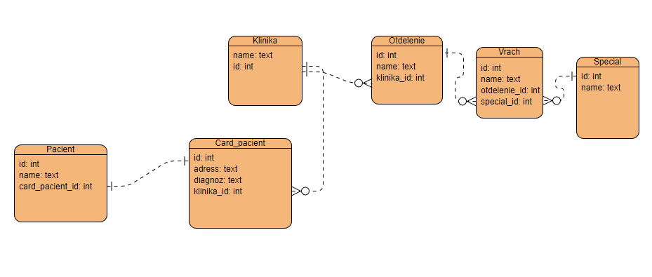

# Дубовський Андрій КС31
Hospital app

## HTTP Verbs
| HTTP METHOD | URL    | Payload | Description                      |
|-------------|--------|---------|----------------------------------|
| GET         | /pacients     |         | показує всіх пацієнтів           |
|   POST          |   /pacients            |         | створює нового пацієнта          |
|    GET         |   /pacients/new            |         | створює нового пацієнта          |
|     GET        |    /pacients/:id/edit           |         | редагування пацієнта             |
|    GET         |     /pacients/:id          |         | відкрити пацієнта                |
|    PATCH         |   /pacients/:id            |         | редагувати пацієнта              |
|    PUT         |   /pacients/:id            |         | редагувати пацієнта              |
|    DELETE         |   /pacients/:id            |         | видалити пацієнта                |
|     GET        |     /card_pacients          |         | картки пацієнтів                 |
|     POST        |    /card_pacients           |         | створення картки                 |
|     GET            |   /card_pacients/new                          |         | сторінка створення картки        |
|     GET            |    /card_pacients/:id/edit                         |         | сторінка редагування картки      |
|    GET             |    /card_pacients/:id                         |         | сторінка картки                  |
|    PATCH             |    /card_pacients/:id                         |         | редагування картки               |
|    PUT             |      /card_pacients/:id                       |         | редагквання картки               |
|    DELETE             |    /card_pacients/:id                         |         | видалення картки                 |
|    GET             |     /specials                        |         | всі спеціальності                |
|    POST             |    /specials                         |         | створення спеціальності          |
|    GET             |     /specials/new                        |         | сторінка створення спеціальності |
|    GET                |   /specials/:id/edit                                       |         | сторінка редагування             |
|    GET                |    /specials/:id                                      |         | перегляд спеціальності           |
|    PATCH                |   /specials/:id                      |         | редагування спеціальності        |
|    PUT                |    /specials/:id                                      |         | редагування спеціальності        |
|    DELETE                |  /specials/:id                                        |         | видалення спеціальності          |
|    GET                |   /vraches                                       |         | всі лікарі                       |
|   POST                 |   /vraches                                       |         | новий лікар                      |
|   GET                 |  /vraches/new                                        |         | новий лікар                      |
|   GET                 |  /vraches/:id/edit                                        |         | редагування лікаря               |
|   GET                    |  /vraches/:id                          |         | перегляд лікаря                  |
|   PATCH                    |  /vraches/:id                  |         | редагування лікаря               |
|   PUT                    |  /vraches/:id                   |         | редагування лікаря               |
|   DELETE                    |  /vraches/:id               |         | відалення лікаря                 |
|   GET                    |   /otdelenies                       |         | всі віділення                    |
|   POST                    |  /otdelenies                           |         | нове віділення                   |
|   GET                    |  /otdelenies/new          |         | нове віділення                   |
|   GET                       |  /otdelenies/:id/edit                         |         | редагування відділення           |
|   GET                       |  /otdelenies/:id                         |         | перегляд віділення               |
|   PATCH                       |  /otdelenies/:id                         |         | редагування віділення            |
|   PUT                       |   /otdelenies/:id                        |         | редагування віділення            |
|   DELETE                       | /otdelenies/:id                          |         | видалення віділення              |
|   GET                       |   /klinikas                        |         | всі лікарні                      |
|   POST                       |  /klinikas                         |         | нова лікарня                     |
|   GET                       |  /klinikas/new                         |         | нова лікарні                     |
|   GET                       |   /klinikas/:id/edit                        |         | редагування лікарні              |
|   GET                       |   /klinikas/:id                        |         | показ лікарні                    |
|    PATCH                      |  /klinikas/:id                         |         | редагування лікарні              |
|     PUT                     |    /klinikas/:id                       |         | редагування лікарні              |
|     DELETE                     | /klinikas/:id                          |         | видалення лікарні                |

## ERD diagram

### Labs

- [✓] Task 1 -> Клиники (поля на выбор)
  Отделение (поля на выбор. Клиника может иметь n отделений)
  Врачи(поля на выбор. Отделение может иметь n врачей)
  Специальность(поля на выбор. Врач может иметь 1 специальность)
  карта пациента(поля на выбор В клинике может быть много карт)
  Пациенты(поля на выбор В карте может быть 1 пациент)
- [✓] Task 2 --> Вставити 100 записів у ваші таблиці. У кожній групі по 6 таблиць в 3 таблиці зробити методи, які будуть обгорткою на чистому SQL. У 3 таблиці просто на ОРМ.
  У кожній моделі повинні бути методи на оновлення. В 3 таблиці зробити методи, які будуть обгорткою на чистому SQL. У 3 таблиці просто на ОРМ.
  Зробити по 2 SQL VIEW.
- [✓] Task 3 --> Зробити CRUD форми под кодну модель + README file
- [✓] Task 4 --> Додати гем Devise до вашого веб застосунку (повинна бути можливість зареєструватись/залогінитись/востановити пароль). Додати тести. Додати CSS/JS
- [✓] Task 5 --> 1.  зробити root_page (наповнення яке завгодно але повинне бути посилання на  вхід/реєстрацію)2. Пропрацювати інформацію про лікарні, бібліотеки (треба додати назву, рік створення)3.  створити таблиці як на зображені (кожна таблиця повинна мати пагінацію,  якщо ви бачите поля "number of ... " то так це кількість моделей в асоціації 🙂 не треба створвати поле треба його порахувати) (додати CSS)4. Створити сторінки під кожну модель5. Додати логіку під Пошук та Сортування ----- Створити це за допомогою QueryObject6. Додати тести під кожний елемент
- [✓] Task 6 --> зробити rake задачу котра буде парсити сайт, Та додавати у вашу БД назву лікарні або бібліотеки
- [✓] Task 7 --> В залежності від того с чим ви працюєте продивитись файл додати поля (Street Address,City,Zip Code) до бібліотек та (type, city, RatingMortality) у лікарні додати файл до додатка (наразі просто у папку його покладіть)розпарсить файл та зберігти дані за допомогою rake задачі